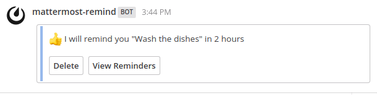
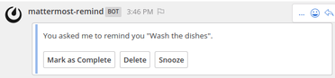

## _Development on this project has ceased, it will be merged into the core mattermost server & webapp [MM-10580](https://github.com/mattermost/mattermost-server/issues/9283) instead._

# mattermost-remind [](https://travis-ci.org/scottleedavis/mattermost-remind) [](https://codecov.io/gh/scottleedavis/mattermost-remind) [](https://www.codacy.com/app/scottleedavis/mattermost-remind?utm_source=github.com&amp;utm_medium=referral&amp;utm_content=scottleedavis/mattermost-remind&amp;utm_campaign=Badge_Grade)

A /remind slash command for [Mattermost](https://mattermost.com/) built with [Spring Boot](https://spring.io/projects/spring-boot)

`/remind [@someone or ~channel] [what] [when]`




### usage

See the full list of [Usage Examples](https://github.com/scottleedavis/mattermost-remind/wiki/Usage) in the [wiki](https://github.com/scottleedavis/mattermost-remind/wiki) 
* `/remind help`
* `/remind list`
* `/remind version`
* `/remind [who] [what] [when]`
  * `/remind [who] [what] in [# (seconds|minutes|hours|days|weeks|months|years)]`
  * `/remind [who] [what] at [(noon|midnight|one..twelve|00:00am/pm|0000)] (every) [day|date]`
  * `/remind [who] [what] (on) [(Monday-Sunday|Month&Day|MM/DD/YYYY|MM/DD)] (at) [time]`
  * `/remind [who] [what] every (other) [Monday-Sunday|Month&Day|MM/DD] (at) [time]`
* `/remind [who] [when] [what]`

### releases

* Tracked in [Github projects](https://github.com/scottleedavis/mattermost-remind/projects)
* Next release targeted: [Release 0.0.5](https://github.com/scottleedavis/mattermost-remind/projects/4)
* Want to contribute?  Identify an [issue](https://github.com/scottleedavis/mattermost-remind/issues), [fork](https://help.github.com/articles/fork-a-repo/) this repository and submit a [Pull Request](https://github.com/scottleedavis/mattermost-remind/pulls).

### bugs & issues

* Request a feature or report a bug in [Github issues](https://github.com/scottleedavis/mattermost-remind/issues).
* Don't have a github account?  [Use this form](https://gitreports.com/issue/scottleedavis/mattermost-remind/)

### setup 

#### requirements
* Run: [Java8 JRE](http://openjdk.java.net/install/)
* Run: [Docker](https://www.docker.com/) (Optional)
* Use: [Mattermost](https://mattermost.com/) 

##### Mattermost Integration

* Create an administrative user named `mattermost-remind`
  * get userId for mattermost-remind `sudo ./mattermost user search mattermost-remind`
  * put userId in ENV where java/image will run `REMIND_USER=<USER_ID>`
* Ensure Custom Integrations (in System Console) has the following enabled
  * `Enable Incoming Webhooks`
  * `Enable Custom Slash Commands`
  * `Enable integrations to override usernames` & `Enable integrations to override profile picture icons`
* create `remind` as slash command
  * Title & "Autocomplete Description": `Set a reminder`
  * Leave "Description" blank
  * Response Username: `mattermost-remind`
  * Autocomplete hint: `[@someone or ~channel] [what] [when]`
  * Request URL: `<path_to_mattermost-remind>/remind`
  * set mattermost system icon
  * put token in ENV where java/image will run `REMIND_SLASH_TOKEN=<YOUR_TOKEN>`
* create incoming webhook
  * Title & Description: `Set a reminder`
  * Channel: `Town Square`  <= (won't be used)
  * Username: `mattermost-remind`
  * set mattermost system icon
  * put webhook URL in ENV where java/image will run `REMIND_WEBHOOK_URL=<YOUR_WEBHOOK>`

##### Datasources
* [h2](http://www.h2database.com/html/main.html) is the default database
* [PostgreSQL](https://www.postgresql.org/) can be used by changing [application.properties](application/src/main/resources/application.properties) and create the reminders & occurrences tables (_[reminders.example.postgresql.sql](scripts/reminders.example.postgresql.sql)_)
  ```$xslt
    spring.jpa.properties.hibernate.jdbc.lob.non_contextual_creation=true
    spring.datasource.url=jdbc:postgresql://YOUR_DATABASE_SERVER:5432/YOUR_DATABASE_NAME 
    spring.datasource.username=YOUR_DATABASE_USER 
    spring.datasource.password=postgres@YOUR_DATABASE_PASSWORD  
    spring.datasource.driver-class-name=org.postgresql.Driver
    spring.jpa.properties.hibernate.dialect = org.hibernate.dialect.PostgreSQLDialect
  ```
* [SQL Server](https://www.microsoft.com/en-us/sql-server/default.aspx) can be used by changing [application.properties](application/src/main/resources/application.properties) and create the reminders & occurrences tables  (_[reminders.example.sqlserver.sql](scripts/reminders.example.sqlserver.sql)_)
  ```$xslt
    spring.datasource.url=jdbc:sqlserver://YOUR_DATABASE_SERVER;databaseName=YOUR_DATABASE_NAME
    spring.datasource.username=YOUR_DATABASE_USER
    spring.datasource.password=YOUR_DATABASE_PASSWORD
    spring.datasource.driverClassName=com.microsoft.sqlserver.jdbc.SQLServerDriver
    spring.jpa.hibernate.dialect=org.hibernate.dialect.SQLServer2012Dialect
  ```
* [MySQL](https://www.mysql.com/) can be used by changing [application.properties](application/src/main/resources/application.properties) and create the reminders & occurrences tables  (_[reminders.example.mysql.sql](scripts/reminders.example.mysql.sql)_)
  ```$xslt
    spring.datasource.url=jdbc:mysql://YOUR_DATABASE_SERVER/YOUR_DATABASE_NAME
    spring.datasource.username=YOUR_DATABASE_USER
    spring.datasource.password=YOUR_DATABASE_PASSWORD
    spring.datasource.driverClassName=com.mysql.jdbc.Driver
    spring.jpa.hibernate.dialect=org.hibernate.dialect.MySQLDialect
  ```  
  
### build
* Build: [Maven](https://maven.apache.org/download.cgi) & [Java8](http://openjdk.java.net/install/)
  * `./mvnw  package`
* Build [Docker](https://www.docker.com/) Image 
  * `./mvnw install dockerfile:build`

### execution

* Running via java
```bash
export REMIND_USER="5okns4uk9ffauy16q8rkhe9zjc"
export REMIND_SLASH_TOKEN="7q61n4m5mfbebpme4ga5nu1gdh"
export REMIND_WEBHOOK_URL="http://127.0.0.1:8065/hooks/jqg3bkxbip8hzgsrsnzep5jqyc"

java -jar application/target/mattermost-remind-app-0.0.4.jar
```

* Running via docker 
```bash
docker pull scottleedavis/mattermost-remind
docker run -p 8080:8080 -e "REMIND_USER=5okns4uk9ffauy16q8rkhe9zjc" -e "REMIND_SLASH_TOKEN=7q61n4m5mfbebpme4ga5nu1gdh" -e "REMIND_WEBHOOK_URL=http://127.0.0.1:8065/hooks/jqg3bkxbip8hzgsrsnzep5jqyc" scottleedavis/mattermost-remind:latest
```

